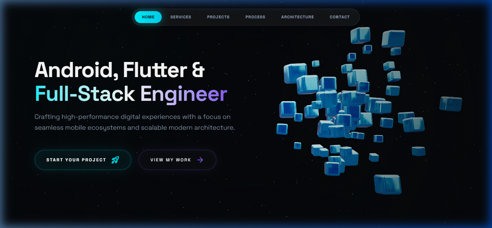
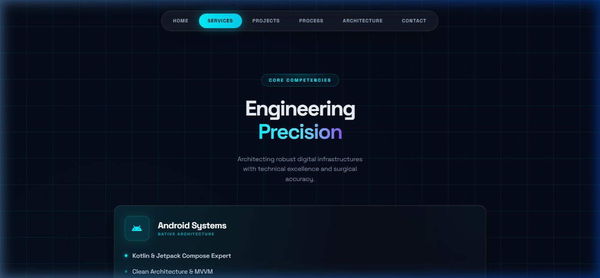
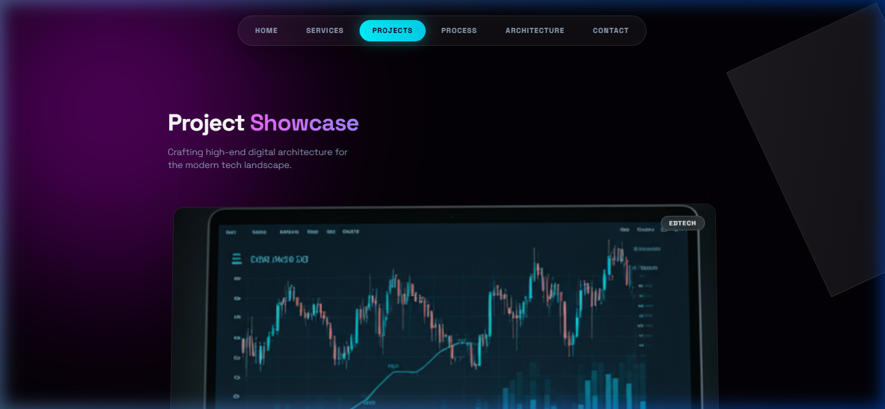
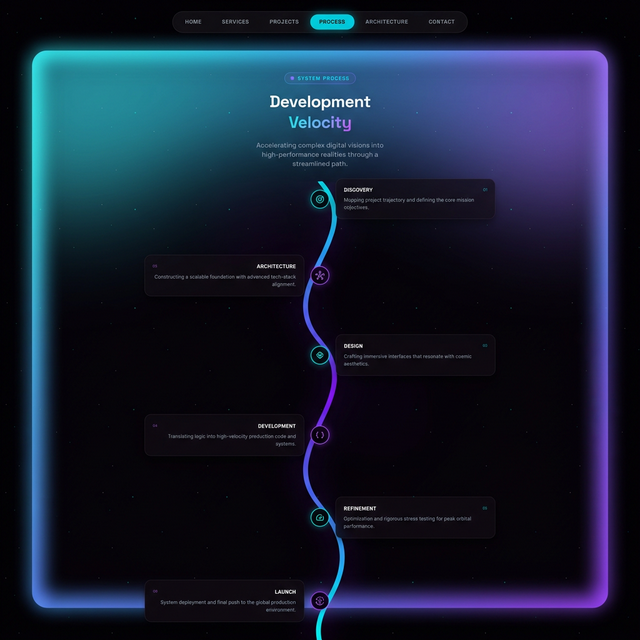
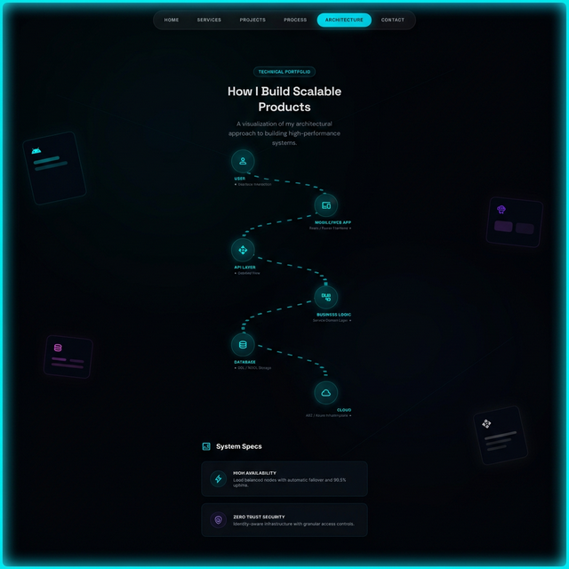
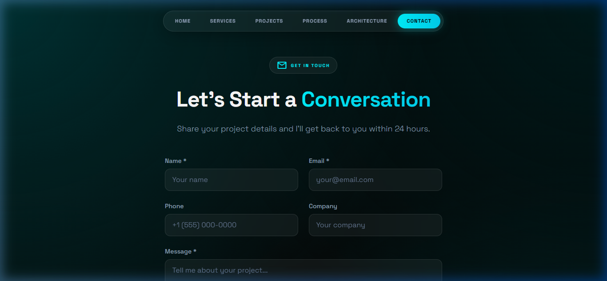

# 🌌 Cosmic Portfolio | Nikhil Yadav

A high-performance, visually immersive developer portfolio built with **React**, **Three.js**, and **Tailwind CSS**. Designed to bridge the gap between complex digital architecture and stunning user experiences.



---

## ✨ Features

- **🚀 Interactive 3D Hero**: A dynamic cube cluster built with `@react-three/fiber` and `@react-three/drei`, featuring physics-based interactions and smooth orbital controls.
- **⚡ High-Velocity SPA**: Seamless client-side routing using `react-router-dom` for instantaneous transitions between project phases.
- **🛠️ Service Orchestration**: Detailed service breakdown with custom-designed interactive cards and hover-driven states.
- **📊 Interactive Timeline**: Visualized project trajectory mapping the journey from Discovery to Deployment.
- **🏗️ Architectural Visualization**: A deep dive into the system's core, showcasing the stack from User Interface to Cloud Infrastructure.
- **📱 Responsive by Design**: Fully optimized for all screen sizes, ensuring a premium experience from desktop to mobile.

---

## 🛠️ Tech Stack

### **Frontend & Frameworks**
- **React 18** (Functional Components, Hooks)
- **TypeScript** (Static Typing, Robust Interfaces)
- **Vite** (Lightning-fast Build Tooling)
- **Tailwind CSS** (Utility-first Styling & Custom Design Tokens)

### **3D & Animations**
- **Three.js** (Core 3D Engine)
- **React Three Fiber** (React Bridge for Three.js)
- **React Three Drei** (Helper Suite for 3D Components)
- **Framer Motion** (Subtle UI Micro-animations)

---

## 📸 Snapshots

### **Homepage & Services**
| Home | Services |
| :---: | :---: |
|  |  |

### **Projects & Development Velocity**
| Projects | Timeline |
| :---: | :---: |
|  |  |

### **System Architecture & Contact**
| Architecture | Contact |
| :---: | :---: |
|  |  |

---

## 🚀 Getting Started

1.  **Clone the Repository**
    ```bash
    git clone https://github.com/nikhilyadav01/portfolio.git
    cd portfolio/me
    ```

2.  **Install Dependencies**
    ```bash
    npm install
    ```

3.  **Launch the System**
    ```bash
    npm run dev
    ```

---

## 🏗️ Project Structure

- `src/components`: Core UI blocks (Hero, Navbar, Timeline, etc.)
- `src/assets`: Static assets and global styles
- `public/snapshots`: Project visual documentation
- `App.tsx`: Routing and main assembly

---

*Designed with 💜 by Nikhil Yadav*
